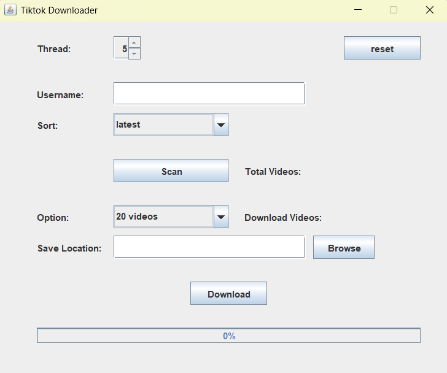
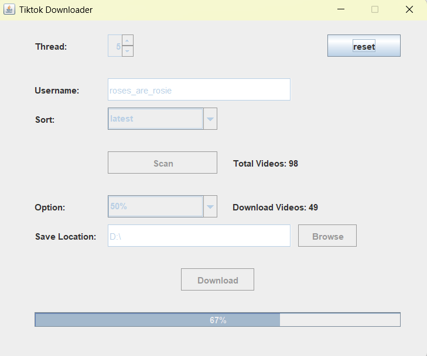
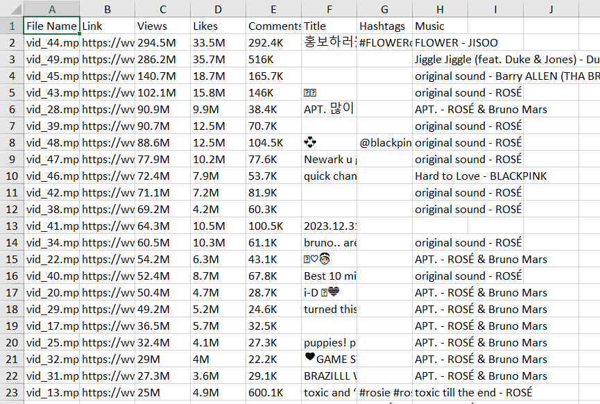

**A simple project download all videos from user on TikTok using Java, Java Selenium, JavaSwing**

**Main features:**

  - download all videos from user
  - export an excel file contains infomation such as views, likes, comments

**Guide:**

  - Enter username(not the URL)
  - Scan videos
  - Choose a save location, then click download

**Sample results:**

